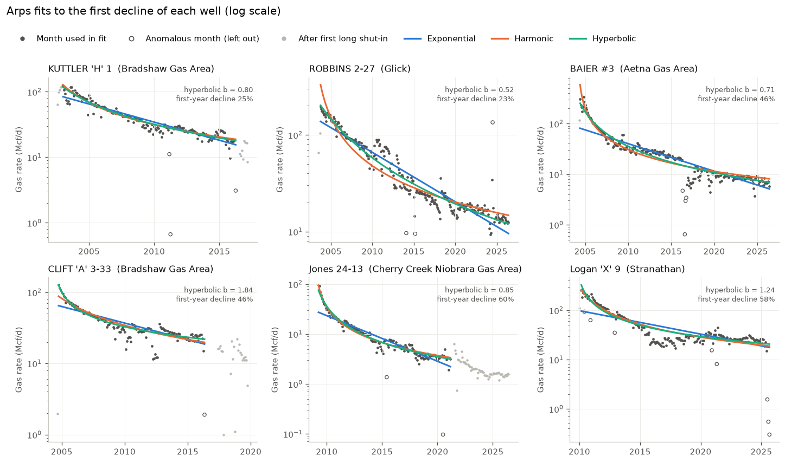
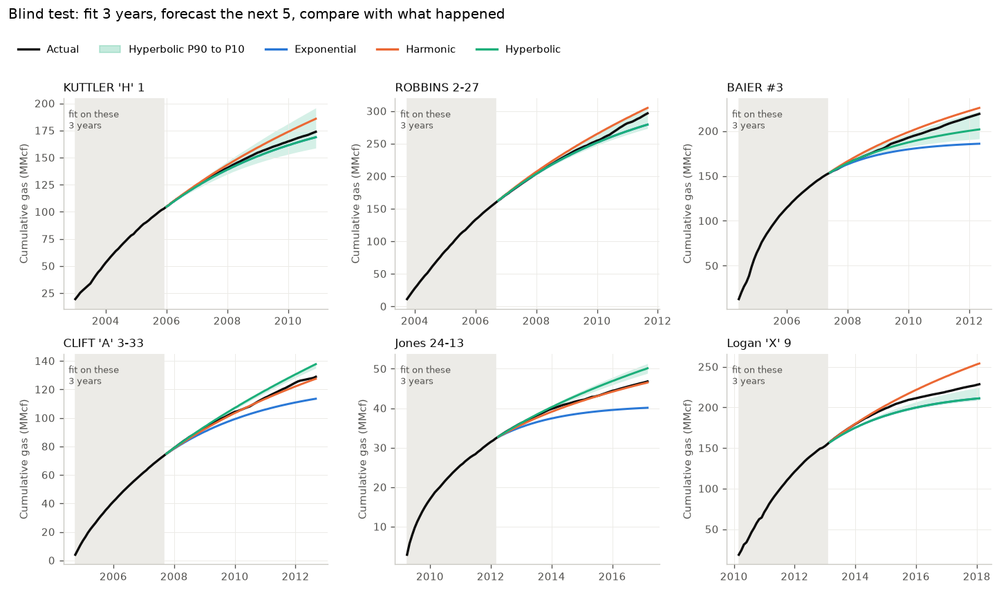
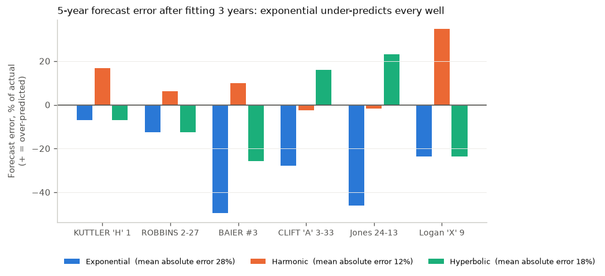
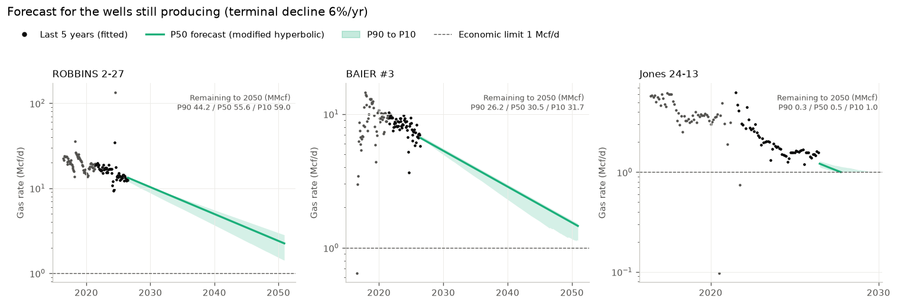

# Gas-well decline analysis and production forecasting

Decline-curve analysis (DCA) of six real Kansas gas wells using public monthly production data from the Kansas Geological Survey (KGS). The project:

1. Fits three Arps decline models to each well's history.
2. Tests how well each model forecasts in a blind 5-year hindcast.
3. Forecasts the wells that are still producing, with a P90 / P50 / P10 range.

New to this? Open [`notebooks/gas_dca_walkthrough.ipynb`](notebooks/gas_dca_walkthrough.ipynb) in Google Colab. It walks through every step in plain language with worked numbers.

[](https://colab.research.google.com/github/Lissha01/gas-decline-analysis/blob/main/notebooks/gas_dca_walkthrough.ipynb)

## Units and terms

| Term | Meaning |
|---|---|
| Mcf / MMcf | thousand / million standard cubic feet of gas |
| Mcf/d | gas rate, Mcf per day |
| qi | initial rate (Mcf/d) |
| Di | initial nominal decline rate (per year in tables, per day in code) |
| b | Arps exponent: 0 = exponential, 1 = harmonic, in between = hyperbolic |
| EUR | estimated ultimate recovery: all the gas a well will ever produce. Only used when a forecast runs all the way to the economic limit |
| P90 / P50 / P10 | low / middle / high case: the 10th / 50th / 90th percentile of a forecast ensemble. They describe spread *under the chosen model and bootstrap*, not real-world probabilities |

## Data

Six single-well leases from five Kansas gas fields, all first producing after 2000. Monthly gas volumes run to June 2026.

| Well | Field | County | First month | Months | Total produced (MMcf) |
|---|---|---|---|---|---|
| KUTTLER 'H' 1 | Bradshaw Gas Area | Greeley | 2002-08 | 173 | 220.3 |
| ROBBINS 2-27 | Glick | Kiowa | 2003-07 | 275 | 423.5 |
| BAIER #3 | Aetna Gas Area | Barber | 2004-05 | 264 | 284.5 |
| CLIFT 'A' 3-33 | Bradshaw Gas Area | Greeley | 2004-09 | 163 | 170.6 |
| Jones 24-13 | Cherry Creek Niobrara Gas Area | Cheyenne | 2009-04 | 200 | 55.6 |
| Logan 'X' 9 | Stranathan | Barber | 2010-01 | 189 | 300.3 |

- `data/wells.csv` lists each well and links to its KGS lease page.
- `data/kgs_gas_monthly.csv` holds the monthly volumes.
- `python scripts/fetch_kgs.py` downloads them again from KGS.

Source: [Kansas Geological Survey oil and gas production database](https://www.kgs.ku.edu/PRS/petroDB.html). KGS licenses production data before 1987 from IHS and does not allow it to be redistributed. All the data here is from after 2000.

## Method

**1. Rate from volume.** KGS reports gas sold per month, not producing days. So the rate is a calendar-day rate:

rate = monthly volume ÷ days in the month

For example, Logan 'X' 9 produced 3,423 Mcf in January 2010, so its rate was 3,423 ÷ 31 = 110.4 Mcf/d.

**2. Fit window.**
- The window starts at the peak month within the first 6 producing months.
- It ends at the first shut-in of 3 or more months.
- Months whose rate departs strongly from the months around them are flagged as anomalous and left out of the fit. A month is flagged if its rate is below half, or above twice, the median of the 5 months around it, or below 30% of the median of the previous year. Partial-month downtime, late reporting or curtailment could explain these months, but monthly volumes alone cannot show which. Their gas still counts in cumulative production, and the hindcast is repeated without the filter to show how much it matters (step 4).

**3. Arps models.**
- Exponential: q = qi·e^(−Di·t)
- Hyperbolic: q = qi / (1 + b·Di·t)^(1/b)
- Harmonic: the hyperbolic with b = 1

Each model is fitted by robust least squares on ln(rate). Working in logs means a 10% miss counts the same at any rate.

**4. Blind test (hindcast).** For each model:
- The cutoff is 36 months after the peak. Everything that shapes the forecast (fit window, anomaly flags, fits, bootstrap) is computed from the months before the cutoff only. A test checks that changing every later month leaves the fits unchanged.
- Predict the next 60 calendar months, every month included. A month with zero or no reported production counts as zero actual gas, and the curves still have to predict it. KGS lists no zero months, so "produced nothing" and "record missing" cannot be told apart. The number of such months is reported in `results/hindcast.csv`.
- Compare the predicted gas with the gas actually produced over those 60 months.

**5. Forecast.**
- Applies to the three wells still producing in 2026.
- Fits a hyperbolic (b between 0 and 1) to the last 60 months.
- Switches to an exponential when the annual decline reaches 6% (the *modified hyperbolic*). This stops b from forecasting gas that never runs out.
- Each forecast ends at 1 Mcf/d or at the end of 2050, whichever comes first.

**6. Uncertainty.** A residual block bootstrap builds 200 alternative histories from the fitted trend. Each one is a different reshuffle of 6-month blocks of the fit's misfit. Every history is refitted and forecast. The 10th, 50th and 90th percentiles of remaining gas give P90, P50 and P10. These only capture month-to-month noise around one model. They do not include the chance that the model itself is wrong, so they are not real-world probabilities.

## Results

### Full-history fits



Fitted hyperbolic b ranges from 0.52 to 1.84. Five of the six wells have b above 0.7, so their decline slows down a lot over time. That is common in tight, low-permeability gas reservoirs. All parameters are in `results/fit_parameters.csv`.

### Blind 5-year test




| Well | Actual (MMcf) | Exponential | Harmonic | Hyperbolic |
|---|---|---|---|---|
| KUTTLER 'H' 1 | 71.0 | −7% | +17% | −7% |
| ROBBINS 2-27 | 137.2 | −13% | +6% | −13% |
| BAIER #3 | 67.0 | −50% | +10% | −26% |
| CLIFT 'A' 3-33 | 55.4 | −28% | −3% | +16% |
| Jones 24-13 | 14.5 | −46% | −2% | +23% |
| Logan 'X' 9 | 73.6 | −24% | +35% | −24% |
| **Mean absolute error** | | **28%** | **12%** | **18%** |

What the test shows:
- **The exponential model under-predicted every well.** Assuming a constant decline rate is too pessimistic for these wells.
- **Harmonic did best on average,** but over-predicted Logan by 35%. No single model wins on every well.
- **The best fit to history is not the best forecast.** Hyperbolic always fits the past best because it has an extra parameter. It still came second here.
- **The anomaly filter barely matters here.** Without it, the mean absolute errors are 27.7%, 11.9% and 17.9% instead of 27.8%, 12.0% and 18.0% (`results/hindcast_filter_sensitivity.csv`). Only Logan 'X' 9 had flagged months in its 3 training years (3 of 36).
- **The test windows were clean.** All six 60-month test windows had production in every month, so counting zero months changed nothing for these wells.
- **The bootstrap range is too narrow.** The hyperbolic P90 to P10 range contained the actual volume for only 3 of the 6 wells. Noise-based ranges miss the bigger uncertainty, which is picking the wrong model or a change in how the well is operated.

### Forecast for producing wells



| Well | Rate now (Mcf/d) | Produced (MMcf) | Remaining P90 / P50 / P10 (MMcf) | Produced + remaining, P50 (MMcf) | P50 forecast stops because |
|---|---|---|---|---|---|
| ROBBINS 2-27 | 12.9 | 423.5 | 44.2 / 55.6 / 59.0 | 479.1 (to end-2050) | end of 2050, still producing |
| BAIER #3 | 6.7 | 284.5 | 26.2 / 30.5 / 31.7 | 315.0 (to end-2050) | end of 2050, still producing |
| Jones 24-13 | 1.5 | 55.6 | 0.3 / 0.5 / 1.0 | 56.2 (EUR) | rate reaches 1 Mcf/d, Oct 2027 |

- **Rate now** is the average of the last 6 months.
- **Only Jones 24-13 has an EUR.** ROBBINS and BAIER are still above the economic limit when the forecast stops at the end of 2050. Their total is recovery to 2050, not ultimate recovery, which would need a longer forecast and a justified abandonment rate.
- **The real range is likely wider.** The P90 to P10 values are ensemble percentiles under one model. The hindcast shows that range missed the actual result for half the wells.

## Limitations

- **Calendar-day rates.** Without producing days, a low month cannot be explained, only flagged. The filter is a rule of thumb, not a diagnosis.
- **Sales volumes, not well tests.** Line pressure, compression and curtailment all show up in the data as if they were reservoir decline.
- **Arps is empirical.** It assumes the same operating conditions continue in the future. It does not model the reservoir, and it does not account for refracs, workovers or new wells nearby.
- **Fixed economic inputs.** The 1 Mcf/d limit and 6% terminal decline are fixed assumptions, not based on prices or costs.
- **Small sample.** Six wells is a demonstration, not a statistical study.

## How to run

```bash
pip install -r requirements.txt
python -m pytest -q        # 11 tests
python run_analysis.py     # writes results/*.csv and figures/*.png
```

GitHub Actions runs the tests and refreshes the figures and results on every push to the code or data.

## Layout

```
gasdca/arps.py        Arps rate and cumulative equations, modified hyperbolic
gasdca/data.py        loading, rate conversion, fit window, anomaly flags
gasdca/fit.py         robust fitting, block bootstrap, P90/P50/P10
gasdca/workflow.py    full-history fits, hindcast, forward forecast
run_analysis.py       runs everything and writes figures and tables
scripts/fetch_kgs.py  re-downloads the data from KGS
tests/                checks on the equations, fitting, filters and data
notebooks/            plain-language walkthrough for Google Colab
```

## Review fixes (October 2026)

An outside review found five weaknesses, all now fixed:
1. **Possible look-ahead in the blind test.** The anomaly flags used a centred window over the whole series, so months after the cutoff could affect which training months were kept. Now all preprocessing uses the history before the cutoff only, and a test checks it. For these six wells the flags were identical either way, so no result changed.
2. **The test period could skip months.** It left out zero months and could end early at a later shut-in. It is now a fixed 60-month calendar interval with zero or missing months counted.
3. **"EUR" was used for forecasts cut off at 2050.** It is now labelled as recovery to 2050.
4. **Flagged months were described as downtime.** Rate data cannot show the cause, so they are now called flagged anomalies, with a with/without-filter comparison.
5. **P90/P50/P10 read like real-world probabilities.** They are now described as ensemble percentiles under the model's assumptions.

## Reference

Arps, J.J. (1945). Analysis of decline curves. *Transactions of the AIME*, 160(1), 228–247.

## License

MIT
